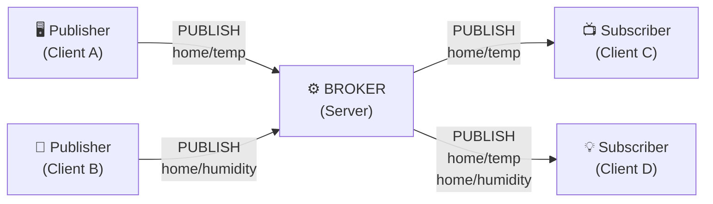
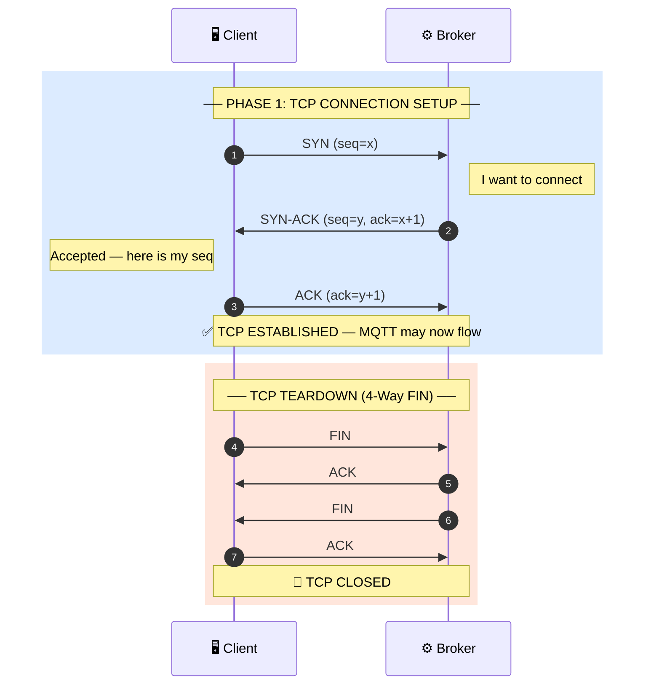
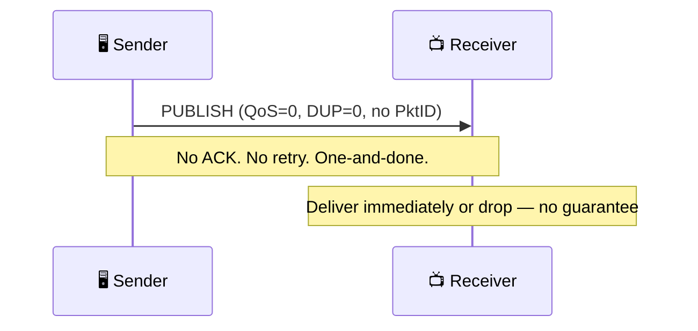
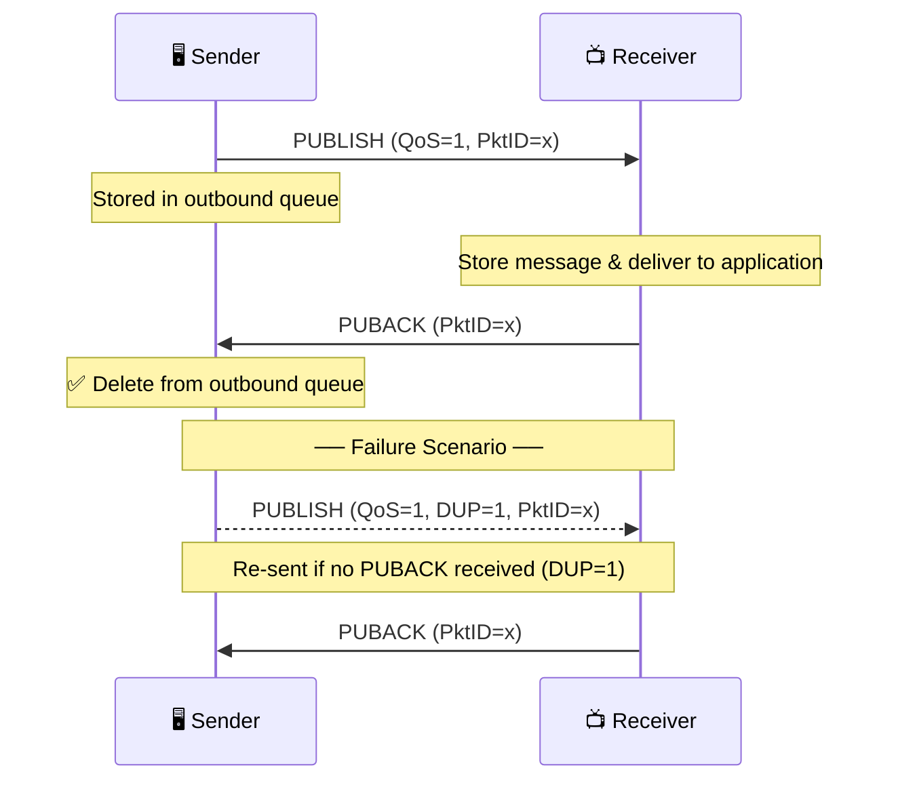
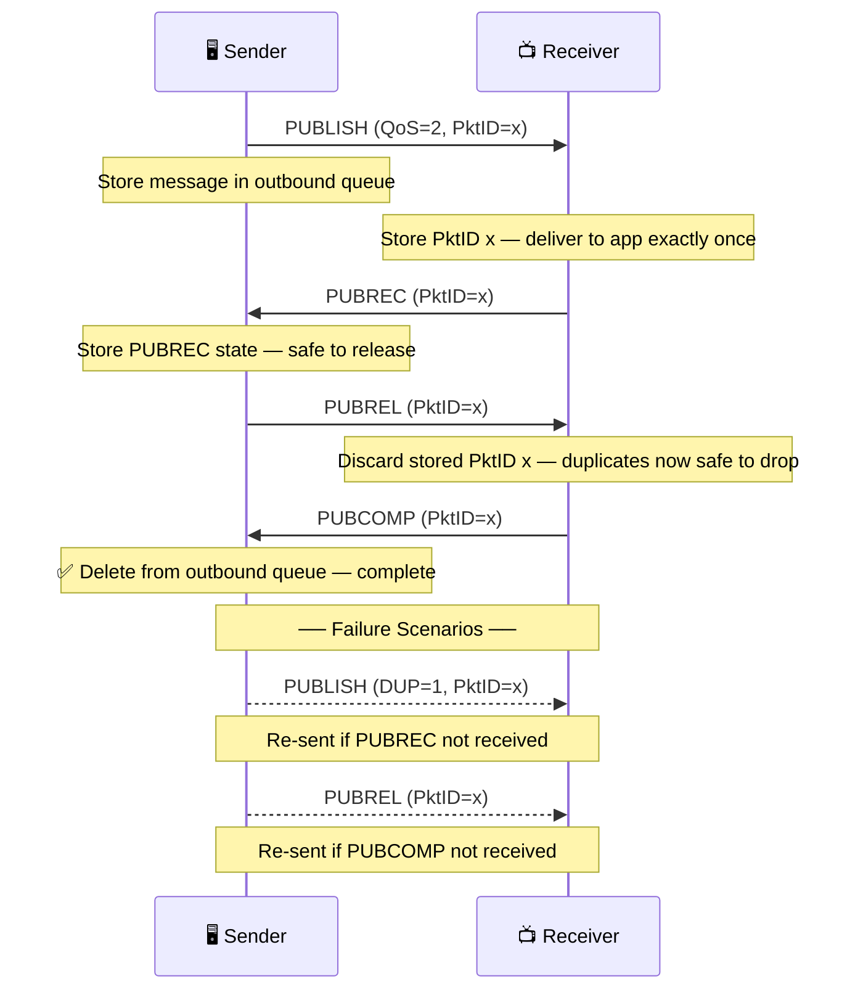
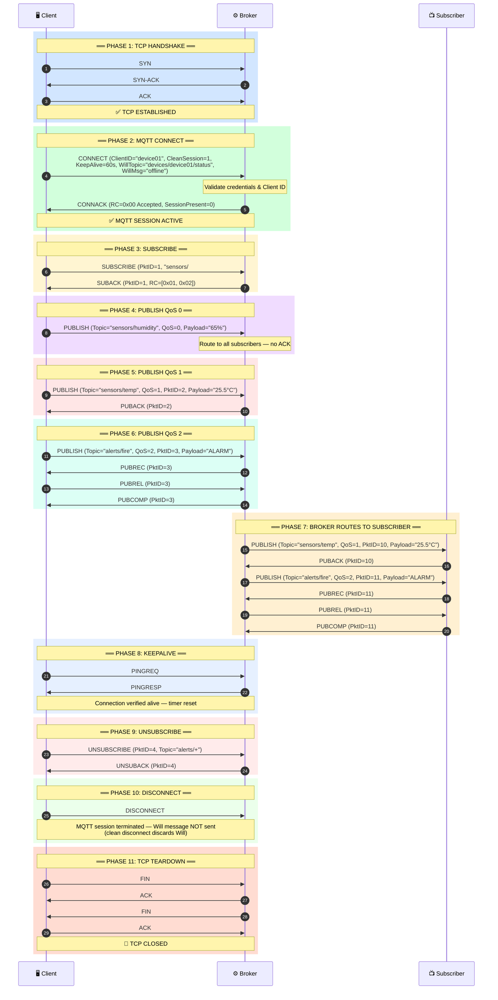
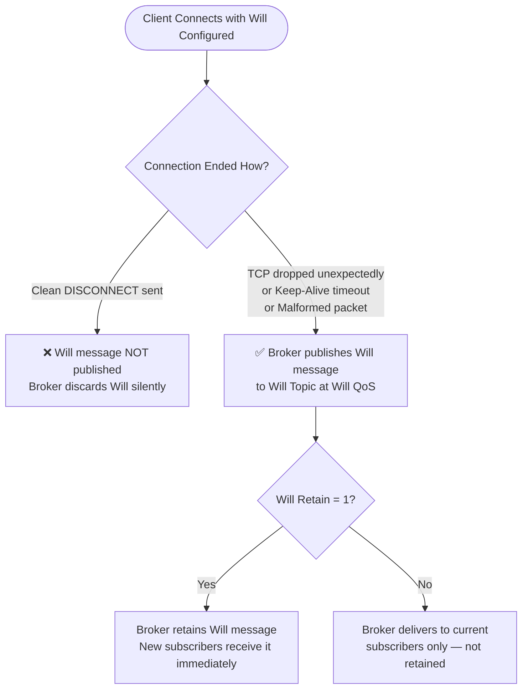
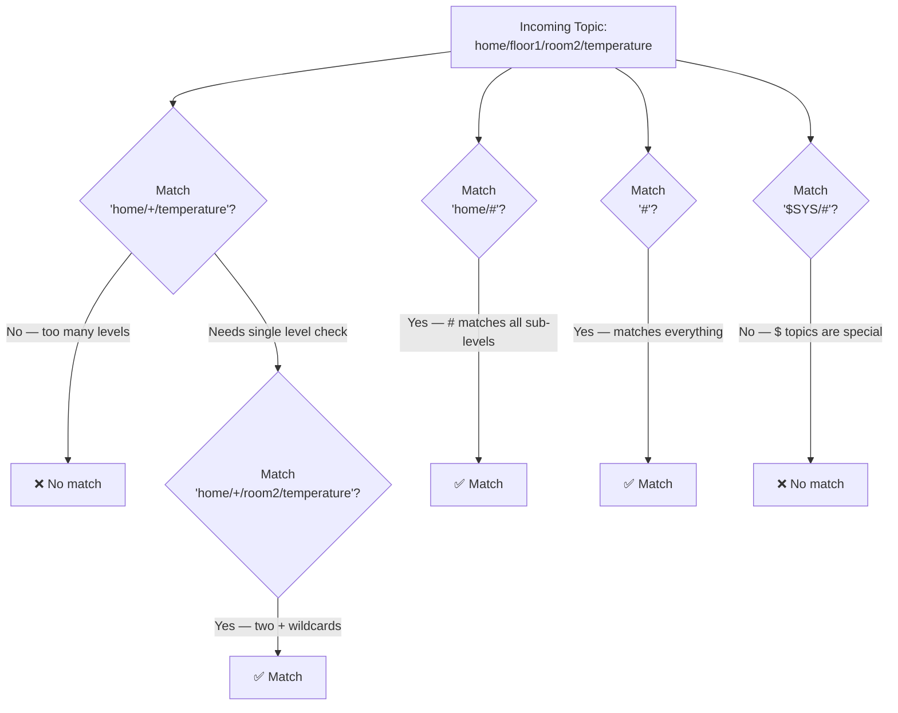

# MQTT Protocol — Complete Technical Reference

> **Standard:** OASIS MQTT v3.1.1 (ISO/IEC 20922) & MQTT v5.0  
> **Transport:** TCP/IP (Port `1883` plain | Port `8883` TLS/SSL)  
> **Last Updated:** 2025

---

## Table of Contents

1. [What is MQTT?](#1-what-is-mqtt)
2. [TCP/IP Requirements for MQTT](#2-tcpip-requirements-for-mqtt)
3. [TCP 3-Way Handshake Flow](#3-tcp-3-way-handshake-flow)
4. [MQTT Packet Structure](#4-mqtt-packet-structure)
5. [All 16 MQTT Control Packet Types](#5-all-16-mqtt-control-packet-types)
6. [Detailed Packet Formats](#6-detailed-packet-formats)
   - 6.1 [CONNECT](#61-connect-packet)
   - 6.2 [CONNACK](#62-connack-packet)
   - 6.3 [PUBLISH](#63-publish-packet)
   - 6.4 [PUBACK](#64-puback-packet-qos-1-ack)
   - 6.5 [PUBREC / PUBREL / PUBCOMP](#65-pubrec--pubrel--pubcomp-qos-2-handshake)
   - 6.6 [SUBSCRIBE](#66-subscribe-packet)
   - 6.7 [SUBACK](#67-suback-packet)
   - 6.8 [UNSUBSCRIBE](#68-unsubscribe-packet)
   - 6.9 [UNSUBACK](#69-unsuback-packet)
   - 6.10 [PINGREQ / PINGRESP](#610-pingreq--pingresp)
   - 6.11 [DISCONNECT](#611-disconnect-packet)
   - 6.12 [AUTH (MQTT 5.0)](#612-auth-packet-mqtt-50-only)
7. [QoS Levels & Flows](#7-qos-levels--flows)
8. [Complete TCP + MQTT Session Flow Diagram](#8-complete-tcp--mqtt-session-flow-diagram)
9. [Will Message (Last Will & Testament)](#9-will-message-last-will--testament)
10. [Topic Structure & Wildcards](#10-topic-structure--wildcards)
11. [MQTT 3.1.1 vs MQTT 5.0 Key Differences](#11-mqtt-311-vs-mqtt-50-key-differences)
12. [Security Considerations](#12-security-considerations)
13. [Quick Reference Cheat Sheet](#13-quick-reference-cheat-sheet)

---

## 1. What is MQTT?

**MQTT (Message Queuing Telemetry Transport)** is a lightweight, binary-based,
publish/subscribe messaging protocol designed for constrained environments with
limited bandwidth, high latency, or unreliable networks.

| Property          | Detail                                                                    |
|-------------------|---------------------------------------------------------------------------|
| **Created by**    | Andy Stanford-Clark (IBM) & Arlen Nipper — oil pipeline telemetry (1999)  |
| **Open Standard** | Released royalty-free 2010; OASIS standard 2014                           |
| **Versions**      | v3.1.1 (most deployed) and v5.0 (feature-rich, 2019)                     |
| **Model**         | Publish / Subscribe (decoupled producers and consumers)                   |
| **Transport**     | TCP/IP (ordered, reliable, bi-directional byte stream)                    |
| **Ports**         | 1883 (plain), 8883 (TLS), 80/443 (WebSockets)                            |
| **Overhead**      | Minimum 2-byte fixed header — extremely bandwidth-efficient               |

---

### 1.1 Core Architecture



| Role           | Description                                                       |
|----------------|-------------------------------------------------------------------|
| **Broker**     | Central hub — receives, filters, and routes messages by topic     |
| **Publisher**  | Client that sends data to a topic on the broker                   |
| **Subscriber** | Client that registers interest in topic(s) and receives messages  |
| **Topic**      | UTF-8 string hierarchy e.g. `home/living-room/temperature`        |

---

## 2. TCP/IP Requirements for MQTT

MQTT **MUST** run over a transport that provides **ordered, lossless,
bi-directional** connections. TCP/IP is the canonical and universal choice.

| Requirement              | Detail                                                              |
|--------------------------|---------------------------------------------------------------------|
| **Transport Protocol**   | TCP/IP — connection-oriented, reliable, ordered                     |
| **Default Port**         | `1883` (plain-text, IANA reserved)                                  |
| **Encrypted Port**       | `8883` (TLS 1.2/1.3)                                                |
| **WebSocket Port**       | `80` or `443` (MQTT over WebSockets for browsers)                   |
| **Both Endpoints**       | Client AND broker must have a full TCP/IP stack                     |
| **Connection Direction** | Client always initiates — broker has a known public address         |
| **NAT Compatibility**    | Fully supported — client initiates outbound TCP connection          |
| **Min Packet Size**      | 2 bytes (PINGREQ / PINGRESP / DISCONNECT v3.1.1)                    |
| **Max Packet Size**      | 268,435,455 bytes (~256 MB)                                         |
| **Keep-Alive**           | Client sends PINGREQ; broker timeout = 1.5 × Keep-Alive value       |
| **Session Persistence**  | TCP connection kept open for full MQTT session duration             |

> **Why TCP and not UDP?**  
> TCP guarantees in-order, error-corrected, lossless delivery. MQTT's QoS 1 and
> QoS 2 layers build on top of this foundation. UDP cannot provide the
> reliability semantics MQTT requires.

---

## 3. TCP 3-Way Handshake Flow

Before ANY MQTT packet is exchanged, a TCP connection MUST be fully established.



> **Critical Rule:** The MQTT CONNECT packet is NEVER sent until the TCP
> three-way handshake fully completes. When TCP closes, the MQTT session
> is immediately terminated.

---

## 4. MQTT Packet Structure

Every single MQTT control packet follows the same 3-part structure:

```
┌──────────────────────────────────────────────────────────────────┐
│                        MQTT CONTROL PACKET                       │
├──────────────────────┬──────────────────────┬────────────────────┤
│     FIXED HEADER     │   VARIABLE HEADER    │      PAYLOAD       │
│   (Always Present)   │  (Type-dependent)    │  (Type-dependent)  │
│     Min: 2 bytes     │  0 to N bytes        │  0 to N bytes      │
└──────────────────────┴──────────────────────┴────────────────────┘
```

---

### 4.1 Fixed Header — Always Present (Minimum 2 bytes)

```
┌─────────────────────────────────────────────────────────────────┐
│  BYTE 1                                                         │
├──────────┬──────────┬──────────┬──────────┬────┬────┬────┬─────┤
│  Bit 7   │  Bit 6   │  Bit 5   │  Bit 4   │Bit3│Bit2│Bit1│Bit0 │
├──────────┴──────────┴──────────┴──────────┼────┴────┴────┴─────┤
│         Packet Type  (4 bits, MSB)        │  Flags (4 bits LSB) │
└───────────────────────────────────────────┴────────────────────┘

┌─────────────────────────────────────────────────────────────────┐
│  BYTE 2+ — Remaining Length (Variable Byte Integer, 1–4 bytes) │
│  Encodes the number of bytes remaining in the packet            │
└─────────────────────────────────────────────────────────────────┘
```

---

### 4.2 Remaining Length — Variable Byte Integer Encoding

Each byte uses bits 0–6 for data and bit 7 as a continuation flag.

| Remaining Length Range      | Bytes Used | Encoded Range               |
|-----------------------------|------------|-----------------------------|
| 0 – 127                     | 1 byte     | `0x00` – `0x7F`             |
| 128 – 16,383                | 2 bytes    | `0x80 0x01` – `0xFF 0x7F`   |
| 16,384 – 2,097,151          | 3 bytes    | `0x80 0x80 0x01` – ...      |
| 2,097,152 – 268,435,455     | 4 bytes    | up to `0xFF 0xFF 0xFF 0x7F` |

**Encoding Algorithm:**

```
do {
    encodedByte = value MOD 128
    value = value DIV 128
    if (value > 0) encodedByte = encodedByte OR 128   // set continuation bit
    write(encodedByte)
} while (value > 0)
```

---

### 4.3 Fixed Header Flags (Byte 1, Bits 3–0)

These flags are only meaningful in the `PUBLISH` packet.  
All other packet types use **reserved flags** which MUST be set as shown.

| Packet Type  | Bit 3 (DUP) | Bit 2 (QoS MSB) | Bit 1 (QoS LSB) | Bit 0 (RETAIN) |
|--------------|:-----------:|:---------------:|:---------------:|:--------------:|
| PUBLISH      | DUP Flag    | QoS Level MSB   | QoS Level LSB   | RETAIN Flag    |
| PUBREL       | 0           | 0               | 1               | 0  (`0010`)    |
| SUBSCRIBE    | 0           | 0               | 1               | 0  (`0010`)    |
| UNSUBSCRIBE  | 0           | 0               | 1               | 0  (`0010`)    |
| All Others   | 0           | 0               | 0               | 0  (`0000`)    |

**PUBLISH Flag Descriptions:**

| Flag     | Bit | Value = 0                         | Value = 1                               |
|----------|:---:|-----------------------------------|-----------------------------------------|
| `DUP`    |  3  | First transmission                | Re-delivery of a QoS 1 or 2 message    |
| `QoS[1]` |  2  | MSB of 2-bit QoS field            | MSB of 2-bit QoS field                 |
| `QoS[0]` |  1  | LSB of 2-bit QoS field            | LSB of 2-bit QoS field                 |
| `RETAIN` |  0  | No retention                      | Broker retains for new subscribers     |

**QoS Bit Combinations:**

| QoS[1] Bit 2 | QoS[0] Bit 1 | QoS Level | Meaning          |
|:------------:|:------------:|:---------:|------------------|
| 0            | 0            | **0**     | At Most Once     |
| 0            | 1            | **1**     | At Least Once    |
| 1            | 0            | **2**     | Exactly Once     |
| 1            | 1            | —         | RESERVED/Invalid |

---

### 4.4 Variable Header

- Contains packet-type-specific metadata.
- `CONNECT` includes: Protocol Name, Protocol Level, Connect Flags, Keep Alive.
- `PUBLISH` includes: Topic Name, and Packet Identifier (if QoS > 0).
- **Packet Identifier** is a 2-byte big-endian integer, range `0x0001`–`0xFFFF`.
- In MQTT 5.0, Variable Header also includes a **Properties** section:
  a variable-byte-integer `Property Length` followed by key-value Property pairs.

---

### 4.5 Payload

- Contains application data or connection parameters.
- **CONNECT:** Client ID, Will Topic, Will Message, Username, Password.
- **PUBLISH:** Raw application message (binary, JSON, XML, plain-text, etc.).
- **SUBSCRIBE / UNSUBSCRIBE:** List of Topic Filters with requested QoS.
- **SUBACK:** Return code per subscribed topic.

---

## 5. All 16 MQTT Control Packet Types

| Dec | Hex    | Binary      | Packet Type   | Direction       | Description                          |
|-----|--------|-------------|---------------|-----------------|--------------------------------------|
| 1   | `0x10` | `0001 0000` | `CONNECT`     | Client → Broker | Client requests a connection         |
| 2   | `0x20` | `0010 0000` | `CONNACK`     | Broker → Client | Connection acknowledgement           |
| 3   | `0x30` | `0011 0000` | `PUBLISH`     | Client ↔ Broker | Publish application message          |
| 4   | `0x40` | `0100 0000` | `PUBACK`      | Client ↔ Broker | QoS 1 — Publish acknowledgement     |
| 5   | `0x50` | `0101 0000` | `PUBREC`      | Client ↔ Broker | QoS 2 — Publish received (part 1)   |
| 6   | `0x62` | `0110 0010` | `PUBREL`      | Client ↔ Broker | QoS 2 — Publish release (part 2)    |
| 7   | `0x70` | `0111 0000` | `PUBCOMP`     | Client ↔ Broker | QoS 2 — Publish complete (part 3)   |
| 8   | `0x82` | `1000 0010` | `SUBSCRIBE`   | Client → Broker | Client subscribes to topic(s)        |
| 9   | `0x90` | `1001 0000` | `SUBACK`      | Broker → Client | Subscribe acknowledgement            |
| 10  | `0xA2` | `1010 0010` | `UNSUBSCRIBE` | Client → Broker | Client unsubscribes from topic(s)    |
| 11  | `0xB0` | `1011 0000` | `UNSUBACK`    | Broker → Client | Unsubscribe acknowledgement          |
| 12  | `0xC0` | `1100 0000` | `PINGREQ`     | Client → Broker | Keep-alive ping request              |
| 13  | `0xD0` | `1101 0000` | `PINGRESP`    | Broker → Client | Keep-alive ping response             |
| 14  | `0xE0` | `1110 0000` | `DISCONNECT`  | Client ↔ Broker | Graceful disconnection notice        |
| 15  | `0xF0` | `1111 0000` | `AUTH`        | Client ↔ Broker | **MQTT 5.0 only** — Auth exchange    |

> **Notes:**
> - `PUBREL`, `SUBSCRIBE`, and `UNSUBSCRIBE` have fixed flags `0010` (not `0000`).
> - `AUTH` packet type does not exist in MQTT v3.1.1.

---

## 6. Detailed Packet Formats

---

### 6.1 CONNECT Packet

**Purpose:** First packet sent by a client after TCP is established.
Only ONE CONNECT packet per TCP connection is permitted.

```
┌──────────────────────────────────────────────────────────────┐
│  FIXED HEADER                                                │
│  Byte 1: 0x10        Packet Type=1, Flags=0000              │
│  Byte 2: Remaining Length (variable byte integer)           │
├──────────────────────────────────────────────────────────────┤
│  VARIABLE HEADER                                             │
│  ┌──────────────────────────────────────────────────────┐   │
│  │ Bytes 1-2 : Protocol Name Length   = 0x00 0x04       │   │
│  │ Bytes 3-6 : Protocol Name          = "MQTT"          │   │
│  │ Byte  7   : Protocol Level         = 0x04 (v3.1.1)   │   │
│  │                                    = 0x05 (v5.0)     │   │
│  │ Byte  8   : Connect Flags          (see below)        │   │
│  │ Bytes 9-10: Keep Alive             (seconds, 2 bytes) │   │
│  └──────────────────────────────────────────────────────┘   │
├──────────────────────────────────────────────────────────────┤
│  CONNECT FLAGS — Byte 8 Bit Breakdown                        │
│  ┌─────┬─────┬────────────┬──────────┬──────┬───────┬────┐  │
│  │ Bit7│ Bit6│  Bit5      │  Bit4-3  │ Bit2 │ Bit1  │ B0 │  │
│  ├─────┼─────┼────────────┼──────────┼──────┼───────┼────┤  │
│  │User │Pass │Will Retain │ Will QoS │ Will │Clean  │ 0  │  │
│  │Name │Word │ (0 or 1)   │ (00-10)  │ Flag │Session│Rsv │  │
│  └─────┴─────┴────────────┴──────────┴──────┴───────┴────┘  │
├──────────────────────────────────────────────────────────────┤
│  PAYLOAD  (fields present only if corresponding flag = 1)    │
│  Order is STRICT — all fields have 2-byte length prefix      │
│  1. Client Identifier  (REQUIRED, UTF-8, unique per broker)  │
│  2. Will Topic         (if Will Flag = 1)                    │
│  3. Will Payload       (if Will Flag = 1)                    │
│  4. User Name          (if UserName Flag = 1)                │
│  5. Password           (if Password Flag = 1, binary)        │
└──────────────────────────────────────────────────────────────┘
```

**Connect Flags Detail:**

| Flag          | Bit(s) | Description                                              |
|---------------|--------|----------------------------------------------------------|
| User Name     | 7      | `1` = username is present in payload                    |
| Password      | 6      | `1` = password is present in payload                    |
| Will Retain   | 5      | `1` = Will message is retained by broker                |
| Will QoS      | 4–3    | QoS for the Will message (`00`, `01`, or `10`)          |
| Will Flag     | 2      | `1` = Will message is present                           |
| Clean Session | 1      | `1` = start new session; `0` = resume stored session    |
| Reserved      | 0      | MUST be `0` — server MUST disconnect if set to `1`      |

---

### 6.2 CONNACK Packet

**Purpose:** Server's acknowledgement of a CONNECT. Always the second packet.

```
┌──────────────────────────────────────────────────────────────┐
│  FIXED HEADER                                                │
│  Byte 1: 0x20        Packet Type=2, Flags=0000              │
│  Byte 2: 0x02        Remaining Length = 2                   │
├──────────────────────────────────────────────────────────────┤
│  VARIABLE HEADER                                             │
│  Byte 1: Connect Acknowledge Flags                          │
│    Bit 0: Session Present Flag                              │
│           0 = New session created (CleanSession=1 or new)   │
│           1 = Existing session resumed (CleanSession=0)     │
│    Bits 7–1: Reserved (MUST be 0)                           │
│  Byte 2: Connect Return Code                                │
│    0x00 = Connection Accepted                               │
│    0x01 = Unacceptable Protocol Version                     │
│    0x02 = Identifier Rejected (Client ID malformed)         │
│    0x03 = Server Unavailable                                │
│    0x04 = Bad User Name or Password                         │
│    0x05 = Not Authorized                                    │
│    0x06–0xFF = Reserved (future use)                        │
├──────────────────────────────────────────────────────────────┤
│  PAYLOAD: NONE                                               │
└──────────────────────────────────────────────────────────────┘
```

> If Return Code ≠ `0x00`, the broker MUST close the network connection
> after sending CONNACK.

---

### 6.3 PUBLISH Packet

**Purpose:** Send an application message from client to broker, or broker to subscriber.

```
┌──────────────────────────────────────────────────────────────┐
│  FIXED HEADER                                                │
│  Byte 1: 0b 0011 D QQ R                                     │
│           D  = DUP    (bit 3)                               │
│           QQ = QoS    (bits 2-1)                            │
│           R  = RETAIN (bit 0)                               │
│  Byte 2+: Remaining Length                                  │
├──────────────────────────────────────────────────────────────┤
│  VARIABLE HEADER                                             │
│  ┌──────────────────────────────────────────────────────┐   │
│  │ Topic Name Length  (2 bytes, big-endian)              │   │
│  │ Topic Name         (UTF-8, e.g. "home/temp")         │   │
│  │ Packet Identifier  (2 bytes) — ONLY present if QoS>0 │   │
│  └──────────────────────────────────────────────────────┘   │
├──────────────────────────────────────────────────────────────┤
│  PAYLOAD                                                     │
│  Application message data (binary, JSON, XML, plain-text)   │
│  Length = Remaining Length − Variable Header length          │
│  Zero-length payload IS valid                               │
└──────────────────────────────────────────────────────────────┘
```

**PUBLISH Byte-Level Example — Topic `a/b`, QoS 1, PktID=1, Payload `25.5`:**

```
Byte  1: 0x32        → Fixed Header: PUBLISH, QoS=1, DUP=0, RETAIN=0
Byte  2: 0x0C        → Remaining Length = 12
Byte  3: 0x00        → Topic Length MSB
Byte  4: 0x03        → Topic Length LSB = 3 chars
Byte  5: 0x61 ('a')  → Topic[0]
Byte  6: 0x2F ('/')  → Topic[1]
Byte  7: 0x62 ('b')  → Topic[2]
Byte  8: 0x00        → Packet ID MSB
Byte  9: 0x01        → Packet ID LSB = 1
Byte 10: 0x32 ('2')  → Payload start
Byte 11: 0x35 ('5')
Byte 12: 0x2E ('.')
Byte 13: 0x35 ('5')  → Payload end
```

---

### 6.4 PUBACK Packet (QoS 1 ACK)

**Purpose:** Acknowledge receipt of a PUBLISH with QoS 1.

```
┌──────────────────────────────────────────────────────────────┐
│  FIXED HEADER                                                │
│  Byte 1: 0x40        Packet Type=4, Flags=0000              │
│  Byte 2: 0x02        Remaining Length = 2                   │
├──────────────────────────────────────────────────────────────┤
│  VARIABLE HEADER                                             │
│  Bytes 1-2: Packet Identifier (must match original PUBLISH) │
├──────────────────────────────────────────────────────────────┤
│  PAYLOAD: NONE                                               │
└──────────────────────────────────────────────────────────────┘
```

---

### 6.5 PUBREC / PUBREL / PUBCOMP (QoS 2 Handshake)

**Purpose:** Three-packet handshake that guarantees exactly-once delivery.

```
┌──────────────────────────────────────────────────────────────┐
│  PUBREC  (Publish Received — Step 1 of 3)                   │
│  Fixed Header: Byte 1 = 0x50, Byte 2 = 0x02                │
│  Variable Header: Packet Identifier (2 bytes)               │
│  Payload: NONE                                               │
├──────────────────────────────────────────────────────────────┤
│  PUBREL  (Publish Release — Step 2 of 3)                    │
│  Fixed Header: Byte 1 = 0x62  ← FLAGS = 0010 (REQUIRED)    │
│               Byte 2 = 0x02                                 │
│  Variable Header: Packet Identifier (2 bytes)               │
│  Payload: NONE                                               │
├──────────────────────────────────────────────────────────────┤
│  PUBCOMP (Publish Complete — Step 3 of 3)                   │
│  Fixed Header: Byte 1 = 0x70, Byte 2 = 0x02                │
│  Variable Header: Packet Identifier (2 bytes)               │
│  Payload: NONE                                               │
└──────────────────────────────────────────────────────────────┘
```

---

### 6.6 SUBSCRIBE Packet

**Purpose:** Client registers interest in one or more topic filters.

```
┌──────────────────────────────────────────────────────────────┐
│  FIXED HEADER                                                │
│  Byte 1: 0x82        Packet Type=8, Flags=0010 (REQUIRED)   │
│  Byte 2+: Remaining Length                                  │
├──────────────────────────────────────────────────────────────┤
│  VARIABLE HEADER                                             │
│  Bytes 1-2: Packet Identifier (non-zero, 2 bytes)           │
├──────────────────────────────────────────────────────────────┤
│  PAYLOAD  (MUST contain at least ONE topic filter)          │
│  Repeating structure per topic:                             │
│  ┌──────────────────────────────────────────────────────┐   │
│  │ Topic Filter Length (2 bytes, big-endian)             │   │
│  │ Topic Filter        (UTF-8 encoded string)           │   │
│  │ Requested QoS       (1 byte: 0x00, 0x01, or 0x02)    │   │
│  └──────────────────────────────────────────────────────┘   │
│  (Repeat above block for each additional topic filter)      │
└──────────────────────────────────────────────────────────────┘
```

---

### 6.7 SUBACK Packet

**Purpose:** Broker confirms subscriptions with granted QoS per topic.

```
┌──────────────────────────────────────────────────────────────┐
│  FIXED HEADER                                                │
│  Byte 1: 0x90        Packet Type=9, Flags=0000              │
│  Byte 2+: Remaining Length                                  │
├──────────────────────────────────────────────────────────────┤
│  VARIABLE HEADER                                             │
│  Bytes 1-2: Packet Identifier (matches SUBSCRIBE PktID)     │
├──────────────────────────────────────────────────────────────┤
│  PAYLOAD                                                     │
│  One return code byte per topic filter (same order):        │
│    0x00 = Success — Maximum QoS 0 granted                   │
│    0x01 = Success — Maximum QoS 1 granted                   │
│    0x02 = Success — Maximum QoS 2 granted                   │
│    0x80 = Failure (subscription rejected)                   │
└──────────────────────────────────────────────────────────────┘
```

---

### 6.8 UNSUBSCRIBE Packet

**Purpose:** Client removes subscription(s) from one or more topics.

```
┌──────────────────────────────────────────────────────────────┐
│  FIXED HEADER                                                │
│  Byte 1: 0xA2        Packet Type=10, Flags=0010 (REQUIRED)  │
│  Byte 2+: Remaining Length                                  │
├──────────────────────────────────────────────────────────────┤
│  VARIABLE HEADER                                             │
│  Bytes 1-2: Packet Identifier (non-zero, 2 bytes)           │
├──────────────────────────────────────────────────────────────┤
│  PAYLOAD  (MUST contain at least ONE topic filter)          │
│  Topic Filter Length (2 bytes) + Topic Filter (UTF-8)       │
│  (Repeat for additional filters — no QoS byte here)         │
└──────────────────────────────────────────────────────────────┘
```

---

### 6.9 UNSUBACK Packet

**Purpose:** Broker confirms receipt and processing of UNSUBSCRIBE.

```
┌──────────────────────────────────────────────────────────────┐
│  FIXED HEADER                                                │
│  Byte 1: 0xB0        Packet Type=11, Flags=0000             │
│  Byte 2: 0x02        Remaining Length = 2                   │
├──────────────────────────────────────────────────────────────┤
│  VARIABLE HEADER                                             │
│  Bytes 1-2: Packet Identifier (matches UNSUBSCRIBE PktID)   │
├──────────────────────────────────────────────────────────────┤
│  PAYLOAD: NONE                                               │
└──────────────────────────────────────────────────────────────┘
```

---

### 6.10 PINGREQ / PINGRESP

**Purpose:** Keep-alive heartbeat mechanism.

- Sent by client when no other packet has been sent within the Keep Alive window.
- Broker MUST respond with PINGRESP; if no PINGRESP received, client disconnects.
- Broker closes connection if no packet received within 1.5 × Keep Alive.

```
┌──────────────────────────────────────────────────────────────┐
│  PINGREQ  (Client → Broker)                                  │
│  Byte 1: 0xC0    Packet Type=12, Flags=0000                 │
│  Byte 2: 0x00    Remaining Length = 0                       │
│  No Variable Header. No Payload.                            │
├──────────────────────────────────────────────────────────────┤
│  PINGRESP (Broker → Client)                                  │
│  Byte 1: 0xD0    Packet Type=13, Flags=0000                 │
│  Byte 2: 0x00    Remaining Length = 0                       │
│  No Variable Header. No Payload.                            │
└──────────────────────────────────────────────────────────────┘
```

---

### 6.11 DISCONNECT Packet

**Purpose:** Clean disconnection notice from client to broker (v3.1.1).
In MQTT 5.0, broker can also send DISCONNECT with a reason code.

```
┌──────────────────────────────────────────────────────────────┐
│  MQTT v3.1.1 — Client → Broker Only                         │
│  Byte 1: 0xE0    Packet Type=14, Flags=0000                 │
│  Byte 2: 0x00    Remaining Length = 0                       │
│  No Variable Header. No Payload.   (Total: 2 bytes)         │
├──────────────────────────────────────────────────────────────┤
│  MQTT v5.0 — Client ↔ Broker (bidirectional)                │
│  Byte 1: 0xE0                                               │
│  Byte 2+: Remaining Length                                  │
│  Variable Header:                                           │
│    Byte 1: Reason Code                                      │
│      0x00 = Normal disconnection                            │
│      0x04 = Disconnect with Will Message                    │
│      0x81 = Malformed Packet                                │
│      0x82 = Protocol Error                                  │
│      0x89 = Keep Alive timeout                              │
│      0x8E = Session Taken Over                              │
│      0x93 = Receive Maximum Exceeded                        │
│    Remaining bytes: Properties (MQTT 5.0)                   │
│  Payload: NONE                                               │
└──────────────────────────────────────────────────────────────┘
```

> After sending DISCONNECT, client MUST NOT send any more packets and
> MUST close the TCP connection.

---

### 6.12 AUTH Packet (MQTT 5.0 Only)

**Purpose:** Supports extended authentication (e.g., SCRAM, Kerberos,
OAuth challenge-response flows beyond simple username/password).

```
┌──────────────────────────────────────────────────────────────┐
│  FIXED HEADER                                                │
│  Byte 1: 0xF0        Packet Type=15, Flags=0000             │
│  Byte 2+: Remaining Length                                  │
├──────────────────────────────────────────────────────────────┤
│  VARIABLE HEADER                                             │
│  Byte 1: Reason Code                                        │
│    0x00 = Success                                           │
│    0x18 = Continue Authentication (more steps needed)       │
│    0x19 = Re-authenticate                                   │
│  Properties:                                                │
│    0x15 = Authentication Method (UTF-8 string)              │
│    0x16 = Authentication Data   (binary data)               │
├──────────────────────────────────────────────────────────────┤
│  PAYLOAD: NONE                                               │
└──────────────────────────────────────────────────────────────┘
```

---

## 7. QoS Levels & Flows

---

### 7.1 QoS 0 — At Most Once (Fire and Forget)

- **Guarantee:** None. Message may be lost.
- **Retransmission:** Never.
- **Duplicate Protection:** None.
- **Use Case:** Sensor readings where occasional loss is acceptable.
- **Packet Identifier:** Not included in PUBLISH.



---

### 7.2 QoS 1 — At Least Once

- **Guarantee:** Message delivered at least once.
- **Retransmission:** Yes — until PUBACK received.
- **Duplicate Protection:** None — consumer may receive message multiple times.
- **Use Case:** Telemetry where duplicates are tolerable but loss is not.
- **Packet Identifier:** Required in PUBLISH.



---

### 7.3 QoS 2 — Exactly Once (4-Step Handshake)

- **Guarantee:** Exactly once delivery — no loss, no duplicates.
- **Retransmission:** Yes, but with duplicate prevention via 2-phase commit.
- **Use Case:** Financial transactions, billing data, critical commands.
- **Overhead:** Highest — 4 packets per message exchange.



---

### 7.4 QoS Comparison Table

| Property                 | QoS 0          | QoS 1               | QoS 2                |
|--------------------------|----------------|---------------------|----------------------|
| **Delivery Guarantee**   | At most once   | At least once       | Exactly once         |
| **Message Loss Risk**    | Yes            | No                  | No                   |
| **Duplicate Risk**       | No             | Yes                 | No                   |
| **Packets per message**  | 1              | 2 (+ retries)       | 4 (+ retries)        |
| **Packet Identifier**    | Not used       | Required            | Required             |
| **Sender Storage**       | None           | Until PUBACK        | Until PUBCOMP        |
| **Receiver Storage**     | None           | None                | Until PUBCOMP        |
| **Network Overhead**     | Lowest         | Medium              | Highest              |
| **Typical Use Case**     | Sensors / logs | Telemetry / alerts  | Commands / billing   |

---

## 8. Complete TCP + MQTT Session Flow Diagram



---

### 8.1 Session Phase Summary Table

| Phase | Layer | Packets Exchanged                            | Direction    | Notes                          |
|-------|-------|----------------------------------------------|--------------|--------------------------------|
| 1     | TCP   | SYN → SYN-ACK → ACK                        | C↔B (3-way) | Must complete before MQTT      |
| 2     | MQTT  | CONNECT → CONNACK                            | C→B→C        | Only ONE CONNECT allowed       |
| 3     | MQTT  | SUBSCRIBE → SUBACK                           | C→B→C        | Multiple topics per packet     |
| 4     | MQTT  | PUBLISH (QoS 0)                              | C→B          | No ACK — fire and forget       |
| 5     | MQTT  | PUBLISH → PUBACK                             | C→B→C        | QoS 1 — 2-packet exchange      |
| 6     | MQTT  | PUBLISH → PUBREC → PUBREL → PUBCOMP         | C↔B          | QoS 2 — 4-packet exchange      |
| 7     | MQTT  | PUBLISH → PUBACK / PUBCOMP (broker→sub)     | B→S          | Broker routes to subscribers   |
| 8     | MQTT  | PINGREQ → PINGRESP                           | C→B→C        | Every Keep-Alive interval      |
| 9     | MQTT  | UNSUBSCRIBE → UNSUBACK                       | C→B→C        | Remove topic subscription      |
| 10    | MQTT  | DISCONNECT                                   | C→B          | Graceful — Will is NOT sent    |
| 11    | TCP   | FIN → ACK → FIN → ACK                      | C↔B (4-way) | Releases all TCP resources     |

---

## 9. Will Message (Last Will & Testament)

The Will message notifies other clients when a device disconnects **unexpectedly**.



**Typical Will Message Pattern (Online/Offline Status):**

```
On CONNECT:
  WillTopic   = "home/device01/status"
  WillPayload = "offline"
  WillRetain  = 1
  WillQoS     = 1

On successful connect, publisher immediately sends:
  PUBLISH Topic="home/device01/status"  Payload="online"  Retain=1

Result:
  ✅ Subscribers always see current state immediately.
  ✅ If device crashes → broker publishes "offline" → overwrites "online".
```

---

## 10. Topic Structure & Wildcards

MQTT topics are UTF-8 strings using `/` as a hierarchy separator.

### 10.1 Topic Level Examples

```
home/living-room/temperature
home/living-room/humidity
factory/line-1/machine-3/rpm
devices/device01/status
```

### 10.2 Wildcard Characters

| Wildcard | Symbol | Scope          | Valid in        | Description                      |
|----------|--------|----------------|-----------------|----------------------------------|
| Single   | `+`    | One level only | Subscribe only  | Matches exactly one topic level  |
| Multi    | `#`    | Any level(s)   | Subscribe only  | Matches any number of levels     |

### 10.3 Topic Wildcard Flow



### 10.4 Wildcard Examples Table

| Subscription Filter  | Matches                                 | Does NOT Match             |
|----------------------|-----------------------------------------|----------------------------|
| `home/+/temperature` | `home/bedroom/temperature`              | `home/floor1/room/temp`    |
| `home/#`             | `home/`, `home/a/b/c/d`                | `office/desk`              |
| `+/+/temperature`    | `home/room/temperature`                 | `home/temperature`         |
| `#`                  | ALL topics                              | Topics starting with `$`   |
| `home/+/#`           | `home/floor1/room/temp`                 | `home/temperature`         |

### 10.5 Special System Topics

| Topic Pattern                    | Description                                         |
|----------------------------------|-----------------------------------------------------|
| `$SYS/#`                         | Broker system info — read-only                      |
| `$SYS/broker/clients/connected`  | Number of currently connected clients               |
| `$SYS/broker/messages/received`  | Total messages received by broker                   |
| `$share/{group}/{filter}`        | MQTT 5.0 shared subscriptions (load-balanced)       |

> **Rule:** Topics starting with `$` are reserved and NOT matched by `#` or `+`
> wildcards placed at the beginning of a subscription filter.

---

## 11. MQTT 3.1.1 vs MQTT 5.0 Key Differences

| Feature                   | MQTT 3.1.1                     | MQTT 5.0                                      |
|---------------------------|--------------------------------|-----------------------------------------------|
| **Protocol Level Byte**   | `0x04`                         | `0x05`                                        |
| **Reason Codes**          | Basic (0 = ok / else = fail)   | Rich reason codes on ALL acknowledgement pkts |
| **Properties System**     | Not available                  | Key-value properties on every packet type     |
| **Session Expiry**        | Binary (0 or 1)                | Configurable interval in seconds              |
| **Will Delay Interval**   | Not available                  | Delay (seconds) before Will is published      |
| **Message Expiry**        | Not available                  | Per-message TTL (seconds)                     |
| **Topic Alias**           | Not available                  | Integer alias to replace long topic names     |
| **Shared Subscriptions**  | Not supported                  | `$share/{group}/{filter}` load-balancing      |
| **User Properties**       | Not available                  | Custom UTF-8 key-value pairs per message      |
| **AUTH Packet**           | Not available                  | Full extended authentication flow             |
| **Flow Control**          | Not available                  | `Receive Maximum` property limits in-flight   |
| **Payload Format**        | Not available                  | Indicator: UTF-8 (1) or binary (0)            |
| **Content Type**          | Not available                  | MIME type string e.g. `application/json`      |
| **Subscription ID**       | Not available                  | Integer tag to identify which sub matched     |
| **Server Disconnect**     | Not available                  | Broker can send DISCONNECT with reason code   |
| **Request / Response**    | Not available                  | Response Topic + Correlation Data properties  |

---

## 12. Security Considerations

| Threat / Concern           | Recommended Mitigation                                           |
|----------------------------|------------------------------------------------------------------|
| **Eavesdropping**          | Use TLS 1.2/1.3 on port 8883 — encrypts all MQTT traffic       |
| **Plain-text Credentials** | Username/Password sent as binary in CONNECT — always use TLS    |
| **Unauthorized Access**    | Username/Password auth + topic-level ACL rules on broker        |
| **Client Impersonation**   | Mutual TLS (mTLS) — client presents certificate to broker       |
| **DoS / Flooding**         | Rate limiting, max connections, max message size on broker       |
| **Keep-Alive Exploit**     | 1.5× window exploited in SlowITe attack — use short keep-alive |
| **Retained Message Risk**  | Sensitive retained messages persist on broker — clear on use    |
| **WebSocket Security**     | MQTT over WSS (port 443) mandatory for browser-based clients    |
| **Broker Hardening**       | Disable anonymous login, enable ACLs, keep broker updated       |
| **MQTT 5.0 AUTH**          | Use AUTH packet for SCRAM or challenge-response mechanisms      |

---

## 13. Quick Reference Cheat Sheet

### 13.1 Fixed Header First Byte — Full Lookup Table

| Packet Type  | Hex    | Binary        | Fixed Flags         |
|--------------|--------|---------------|---------------------|
| CONNECT      | `0x10` | `0001 0000`   | `0000` Reserved     |
| CONNACK      | `0x20` | `0010 0000`   | `0000` Reserved     |
| PUBLISH QoS0 | `0x30` | `0011 0000`   | `D=0, QQ=00, R=0`  |
| PUBLISH QoS1 | `0x32` | `0011 0010`   | `D=0, QQ=01, R=0`  |
| PUBLISH QoS2 | `0x34` | `0011 0100`   | `D=0, QQ=10, R=0`  |
| PUBACK       | `0x40` | `0100 0000`   | `0000` Reserved     |
| PUBREC       | `0x50` | `0101 0000`   | `0000` Reserved     |
| PUBREL       | `0x62` | `0110 0010`   | **`0010` REQUIRED** |
| PUBCOMP      | `0x70` | `0111 0000`   | `0000` Reserved     |
| SUBSCRIBE    | `0x82` | `1000 0010`   | **`0010` REQUIRED** |
| SUBACK       | `0x90` | `1001 0000`   | `0000` Reserved     |
| UNSUBSCRIBE  | `0xA2` | `1010 0010`   | **`0010` REQUIRED** |
| UNSUBACK     | `0xB0` | `1011 0000`   | `0000` Reserved     |
| PINGREQ      | `0xC0` | `1100 0000`   | `0000` Reserved     |
| PINGRESP     | `0xD0` | `1101 0000`   | `0000` Reserved     |
| DISCONNECT   | `0xE0` | `1110 0000`   | `0000` Reserved     |
| AUTH (v5.0)  | `0xF0` | `1111 0000`   | `0000` Reserved     |

---

### 13.2 Packet Component Presence Matrix

| Packet Type  | Fixed Hdr | Variable Hdr  | Packet ID | Payload  |
|--------------|:---------:|:-------------:|:---------:|:--------:|
| CONNECT      | ✅        | ✅            | ❌        | ✅       |
| CONNACK      | ✅        | ✅            | ❌        | ❌       |
| PUBLISH QoS0 | ✅        | ✅            | ❌        | Optional |
| PUBLISH QoS1 | ✅        | ✅            | ✅        | Optional |
| PUBLISH QoS2 | ✅        | ✅            | ✅        | Optional |
| PUBACK       | ✅        | ✅            | ✅        | ❌       |
| PUBREC       | ✅        | ✅            | ✅        | ❌       |
| PUBREL       | ✅        | ✅            | ✅        | ❌       |
| PUBCOMP      | ✅        | ✅            | ✅        | ❌       |
| SUBSCRIBE    | ✅        | ✅            | ✅        | ✅       |
| SUBACK       | ✅        | ✅            | ✅        | ✅       |
| UNSUBSCRIBE  | ✅        | ✅            | ✅        | ✅       |
| UNSUBACK     | ✅        | ✅            | ✅        | ❌       |
| PINGREQ      | ✅        | ❌            | ❌        | ❌       |
| PINGRESP     | ✅        | ❌            | ❌        | ❌       |
| DISCONNECT   | ✅        | ❌ (v3.1.1)   | ❌        | ❌       |
| AUTH (v5.0)  | ✅        | ✅            | ❌        | ❌       |

---

### 13.3 Key Numbers & Limits

| Parameter                     | Value / Range                                   |
|-------------------------------|-------------------------------------------------|
| Min packet size               | 2 bytes (PINGREQ, PINGRESP, DISCONNECT v3.1.1)  |
| Max packet size               | 268,435,455 bytes (~256 MB)                     |
| Packet Identifier range       | `0x0001` – `0xFFFF` (1 to 65,535)              |
| Keep Alive range              | 0 – 65,535 seconds (0 = disabled)              |
| Broker timeout                | 1.5 × Keep Alive seconds                       |
| Max Client ID length (v3.1.1) | 23 UTF-8 characters (SHOULD allow up to 256)   |
| Topic max length              | 65,535 bytes (UTF-8)                            |
| Remaining Length max bytes    | 4 bytes                                         |
| Default plain port            | TCP `1883`                                      |
| Default TLS port              | TCP `8883`                                      |
| WebSocket port                | `80` (ws) / `443` (wss)                        |

---

### 13.4 CONNACK Return Codes (v3.1.1)

| Code   | Meaning                       | Action            |
|--------|-------------------------------|-------------------|
| `0x00` | Connection Accepted           | Proceed normally  |
| `0x01` | Unacceptable Protocol Version | Disconnect        |
| `0x02` | Identifier Rejected           | Disconnect        |
| `0x03` | Server Unavailable            | Retry later       |
| `0x04` | Bad User Name or Password     | Fix credentials   |
| `0x05` | Not Authorized                | Check ACL / certs |

---

### 13.5 SUBACK Return Codes

| Code   | Meaning            |
|--------|--------------------|
| `0x00` | Granted QoS 0      |
| `0x01` | Granted QoS 1      |
| `0x02` | Granted QoS 2      |
| `0x80` | Failure (rejected) |

---

## References

- [OASIS MQTT v3.1.1 Specification](https://docs.oasis-open.org/mqtt/mqtt/v3.1.1/os/mqtt-v3.1.1-os.html)
- [OASIS MQTT v5.0 Specification](https://docs.oasis-open.org/mqtt/mqtt/v5.0/mqtt-v5.0.html)
- [IANA Service Names — Port 1883 / 8883](https://www.iana.org/assignments/service-names-port-numbers)
- [RFC 793 — Transmission Control Protocol (TCP)](https://www.rfc-editor.org/rfc/rfc793)
- [RFC 5246 — TLS v1.2](https://www.rfc-editor.org/rfc/rfc5246)
- [Eclipse Mosquitto MQTT Broker](https://mosquitto.org/)
- [HiveMQ MQTT Essentials](https://www.hivemq.com/mqtt-essentials/)