# HTTPS & Secure Communication — Complete Notes

---

## 1. Three Core Problems HTTPS Solves

| Problem | Solution |
|---------|----------|
| Eavesdropping | Encryption (Symmetric) |
| Impersonation | Authentication (Certificate + CA) |
| Tampering | Integrity (Hash / HMAC) |

---

## 2. Encryption Types

### Symmetric Encryption
- Same key encrypt + decrypt
- Fast — used for actual data
- Problem: how share key over public internet safely?

### Asymmetric Encryption
- Two keys: Public Key (share freely) + Private Key (never share)
- Encrypt with public key → only private key can decrypt
- Slow — used only for key exchange / handshake

### How Both Work Together

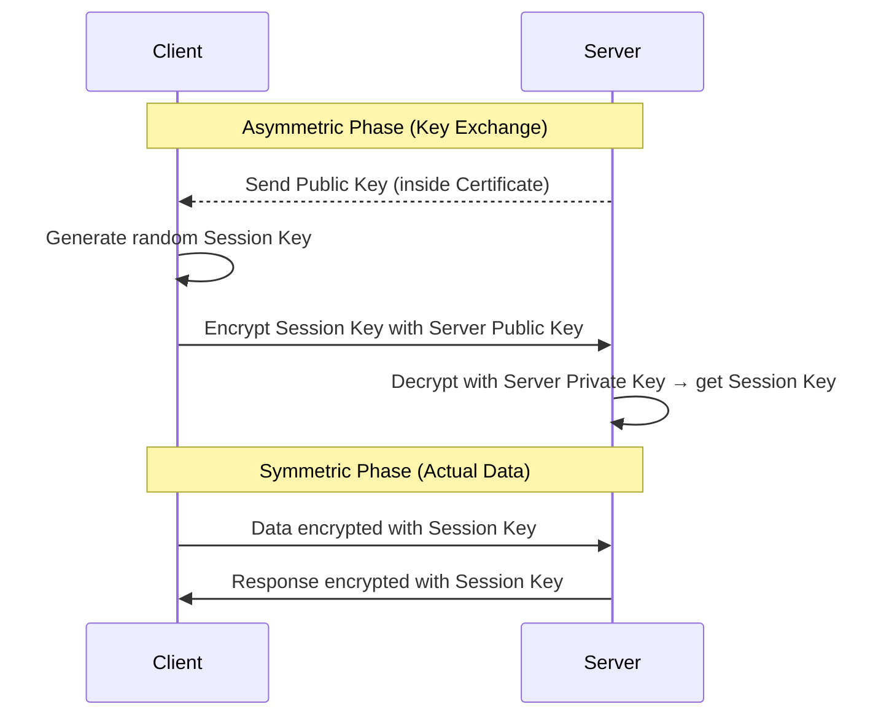

---

## 3. Authentication — Certificates & CA

### The Problem
Anyone can claim "I am google.com" and publish a public key.
Without verification = attacker impersonates server.

### Solution: Certificate Authority (CA)

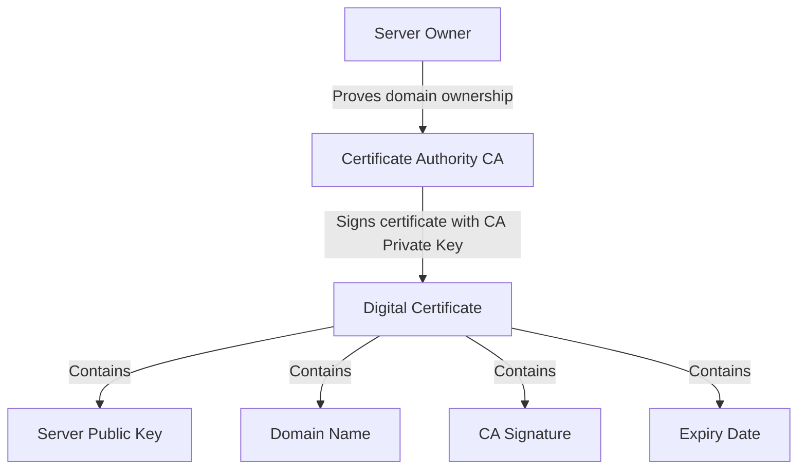

### How Client Verifies Certificate

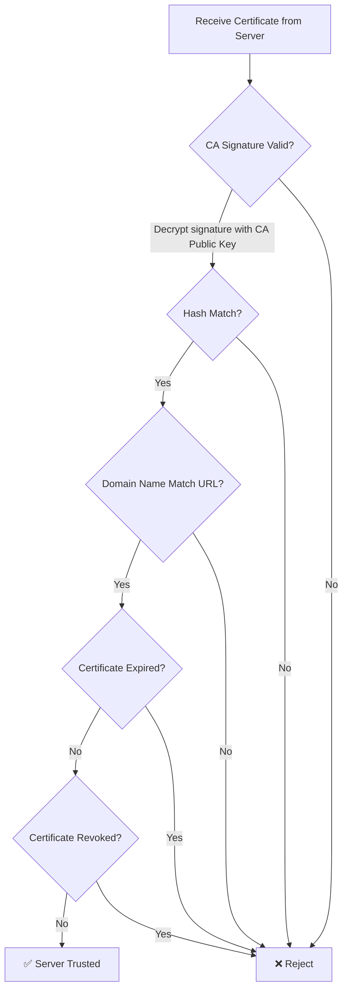

### Certificate Chain (Trust Ladder)

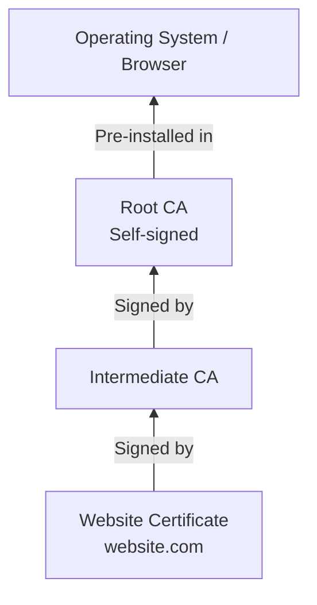

> Root CA private key = kept offline in vault. Never touches internet.
> Intermediate CA = online, but compromise limited scope only.

### Why CA Signature Cannot Be Forged
- CA signature = HMAC of cert data, encrypted with CA private key
- Attacker modify cert → hash different → signature mismatch → rejected
- Attacker forge signature → needs CA private key → mathematically impossible to brute force

---

## 4. Full HTTPS Handshake (TLS 1.3)

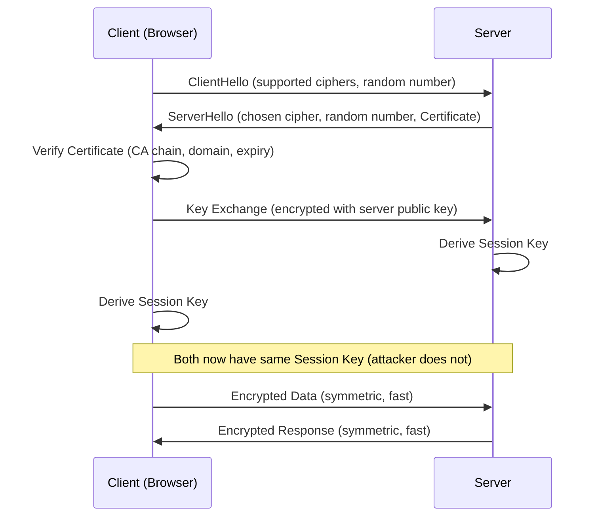

---

## 5. Perfect Forward Secrecy (PFS)

- Old TLS: session key derived from server private key → key leak = all past messages decryptable
- TLS 1.3 (PFS): ephemeral Diffie-Hellman key used → temporary number discarded after session
- Attacker record today's traffic, steal key tomorrow = **still cannot decrypt old messages**

---

## 6. Server Verifying Client (Reverse Authentication)

HTTPS only verifies server. Client must separately prove identity.

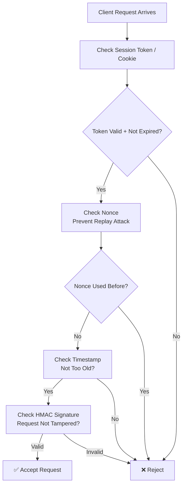

### Methods of Client Authentication

| Method | Use Case | Strength |
|--------|----------|----------|
| Username + Password | Human login | Weak alone |
| Session Token (Cookie) | Browser sessions | Medium |
| MFA (SMS/TOTP/Hardware) | Human login | Strong |
| SAS Token (HMAC) | Machine / IoT | Strong |
| Mutual TLS (mTLS) | Server-to-server | Very Strong |
| API Key + HMAC | API clients | Strong |

---

## 7. SAS Token vs Access Token

### SAS Token (Shared Access Signature)
- Used by: **machines / devices** (IoT, services)
- Generated by: **client itself** using shared key + HMAC math
- No server call needed to generate
- Scope: specific Azure resource
- Expiry: short (1 hour default), regenerate locally

**Format:**
```
SharedAccessSignature sr=<resource>&sig=<HMAC_signature>&se=<expiry>&skn=<policy>
```

**Verification flow:**
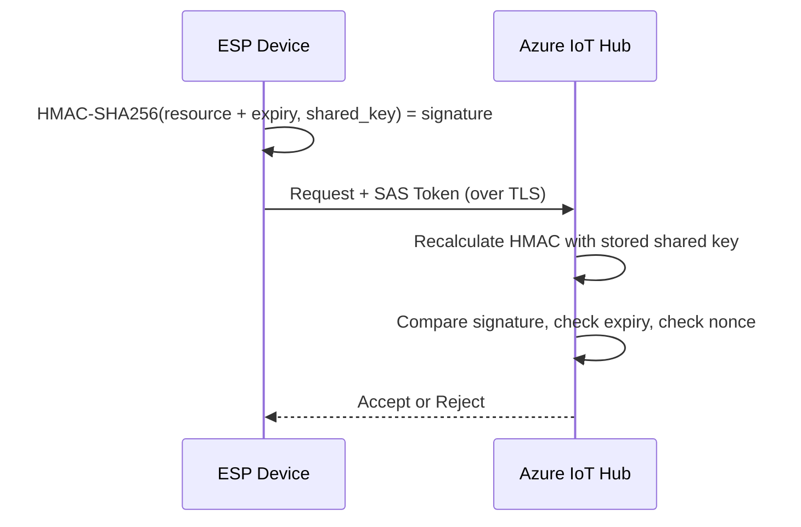

### Access Token (OAuth2 / JWT)
- Used by: **humans / apps acting on behalf of human**
- Generated by: **identity server** (Azure AD, Google, Auth0) — client cannot self-generate
- Requires internet call to identity provider
- Comes with Refresh Token (get new access token without re-login)
- Scope: permissions (read email, write calendar)

**Flow:**
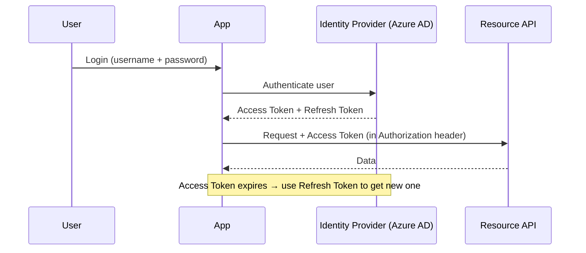

### Key Difference

| | SAS Token | Access Token |
|--|-----------|--------------|
| Who uses | Machine / Device | Human / App |
| Who generates | Client itself | Identity Server |
| Needs internet to generate | No | Yes |
| Has Refresh Token | No | Yes |
| Identity tied to | Device/Service | User |
| Standard | Azure-specific | OAuth2 / OpenID Connect |

---

## 8. Token Placement in Requests

> ⚠️ **NEVER put tokens in URL.** URLs logged everywhere (proxy, server, browser history).

| Protocol | Token Location |
|----------|---------------|
| HTTPS REST | `Authorization` header |
| MQTT | `password` field in CONNECT packet |
| AMQP | SASL token field |

**Correct HTTPS example:**
```http
GET /devices/esp-01/messages HTTP/1.1
Host: myhub.azure-devices.net
Authorization: SharedAccessSignature sr=...&sig=...&se=...
```

---

## 9. ESP Device ↔ Azure IoT Hub

### Problem
- ESP = limited memory, CPU, battery
- Can't do heavy crypto repeatedly
- No browser, no user interaction, no screen

### Full Communication Flow

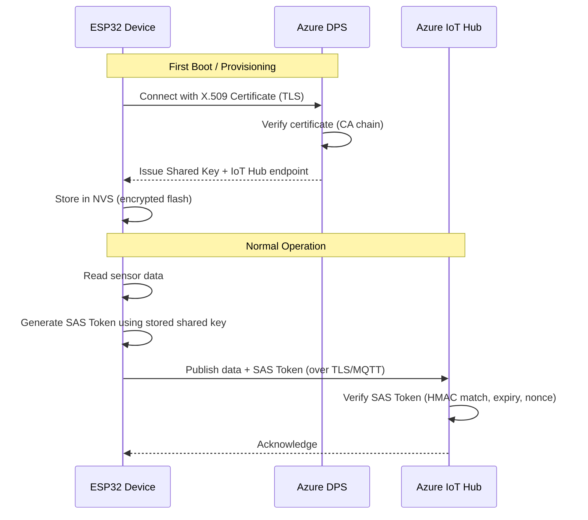

### Replay Attack Prevention on ESP Requests

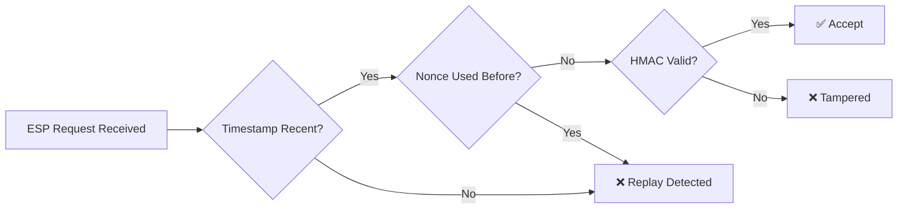

### ESP vs Browser TLS Comparison

| | Browser HTTPS | ESP Device |
|--|--------------|------------|
| TLS | Full handshake | Lightweight TLS |
| CA Verify | Full CA chain | CA bundle or cert fingerprint |
| Auth | Session cookie | SAS Token / Connection String |
| Key type | Asymmetric bootstrap → Symmetric | Same |
| Generate token | No | Yes (self-generated SAS) |

---

## 10. Shared Key Distribution Problem

How does shared key reach device without traveling over network?

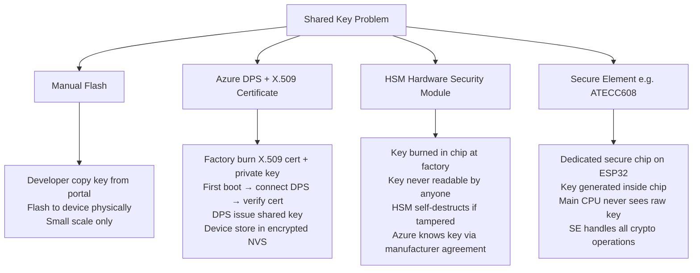

### Key Insight: Asymmetric Bootstraps Symmetric

```
Factory → burn X.509 cert (asymmetric)
         ↓
First boot → prove identity to DPS using cert
         ↓
DPS issues symmetric shared key
         ↓
All future operations → fast symmetric key (SAS Token)
```

Same pattern as HTTPS:
- **Asymmetric** = establish trust (expensive, once)
- **Symmetric** = operate efficiently (cheap, always)

---

## 11. Attack Scenarios & Defenses

| Attack | Method | Defense |
|--------|--------|---------|
| Eavesdrop | Read network traffic | TLS encryption (symmetric) |
| Man-in-Middle | Intercept + re-encrypt | Certificate + CA signature |
| Impersonation | Fake server | Certificate domain check |
| Replay | Resend old valid request | Nonce + Timestamp |
| Tamper | Modify request bytes | HMAC / hash integrity check |
| Token steal | Get SAS/session token | Short expiry + HTTPS encryption |
| Key extraction | Read device memory | HSM / Secure Element |
| CA compromise | Steal CA private key | Offline root CA, HSM vault |
| Typosquatting | g00gle.com fake cert | User attention (CA can't prevent) |

---

## 12. TLS Versions

| Version | Status | Notes |
|---------|--------|-------|
| SSL 2.0 / 3.0 | ❌ Broken | Never use |
| TLS 1.0 / 1.1 | ❌ Deprecated | Vulnerable |
| TLS 1.2 | ✅ Secure | Still widely used |
| TLS 1.3 | ✅ Best | Fewer round trips, PFS mandatory |

---

## 13. Mental Models (Quick Reference)

| Concept | Mental Model |
|---------|-------------|
| CA Signature | Government stamp on passport |
| Certificate | Passport (identity + proof combined) |
| Symmetric Key | House key (both sides same key) |
| Asymmetric Key | Mailbox (anyone drop letter in, only owner open) |
| SAS Token | Temporary access badge (self-printed using secret stamp) |
| Access Token | Security badge from reception (identity provider issues) |
| HSM | Key locked in vault, usable but never readable |
| DPS | Reception desk that issues badges after verifying ID |
| PFS | Burn the key after every conversation |
| Nonce | One-time ticket (used = invalid forever) |