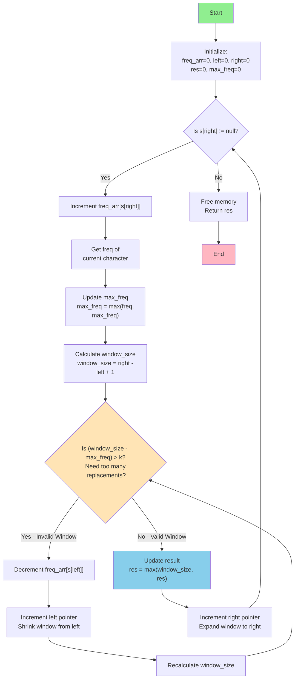

You are given a string s and an integer k. You can choose any character of the string and change it to any other uppercase English character. You can perform this operation at most k times.

Return the length of the longest substring containing the same letter you can get after performing the above operations.

 

Example 1:

Input: s = "ABAB", k = 2
Output: 4
Explanation: Replace the two 'A's with two 'B's or vice versa.
Example 2:

Input: s = "AABABBA", k = 1
Output: 4
Explanation: Replace the one 'A' in the middle with 'B' and form "AABBBBA".
The substring "BBBB" has the longest repeating letters, which is 4.
There may exists other ways to achieve this answer too.

```c
int characterReplacement(char* s, int k) {
    int * freq_arr =calloc(sizeof(int), 26);
    int left =0, right=0;

    int res=0, max_freq_in_window=0;

    while(s[right] != '\0')
    {
        int current_element_freq=0,window_size=right-left+1;

        freq_arr[(unsigned char)s[right]-'A']++;
        current_element_freq=freq_arr[(unsigned char)s[right]-'A'];
        max_freq_in_window=current_element_freq>max_freq_in_window?current_element_freq:max_freq_in_window;
        
        while((window_size-max_freq_in_window)>k)
        {
            freq_arr[(unsigned char)s[left]-'A']--;
            left++;
            window_size=right-left+1;
        }
        res = window_size > res ? window_size : res;
        right++;

    }
    free(freq_arr);
    return res;
}
```

```c
Even though current window after reducing window size does not meet the requirement, we still proceed to procees right when window - 
max_freq meets requirement coz it will never result in changing the res, as it will only be updated when we find a element in a window 
that will result in changignd the max_freq as it will lead to change is res
```

