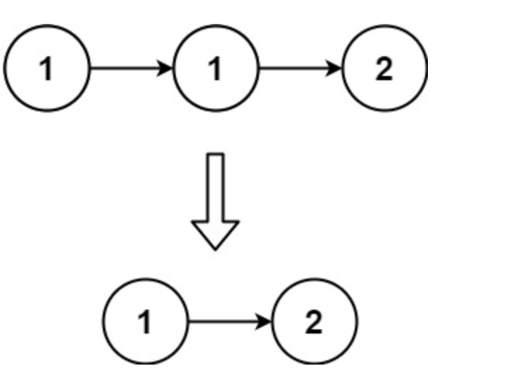
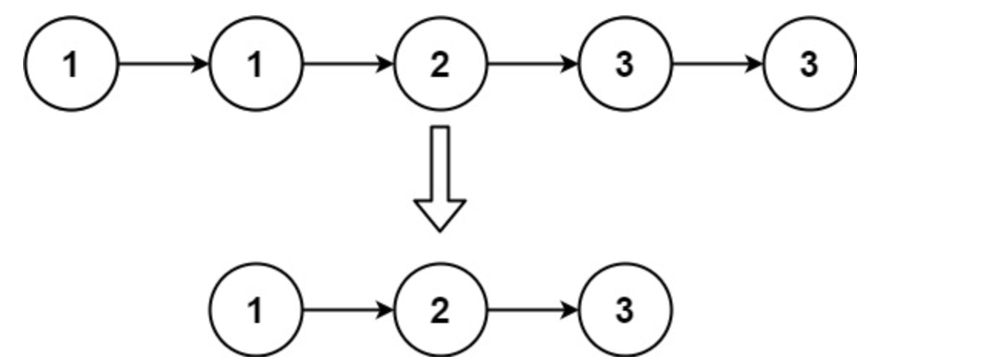

Given the head of a sorted linked list, delete all duplicates such that each element appears only once. Return the linked list sorted as well.

Example 1:



Input: head = [1,1,2]
Output: [1,2]


Example 2:




Input: head = [1,1,2,3,3]
Output: [1,2,3]

```c
/**
 * Definition for singly-linked list.
 * struct ListNode {
 *     int val;
 *     struct ListNode *next;
 * };
 */

typedef struct ListNode Node;
struct ListNode* deleteDuplicates(struct ListNode* head) 
{
    if(!head) return head;
    Node * i = head;
    Node * j = head->next;

    while(j)
    {
        if(i->val == j->val)
            i->next=j->next;
        else 
            i=i->next;
        j=j->next;
    }
return head;
}