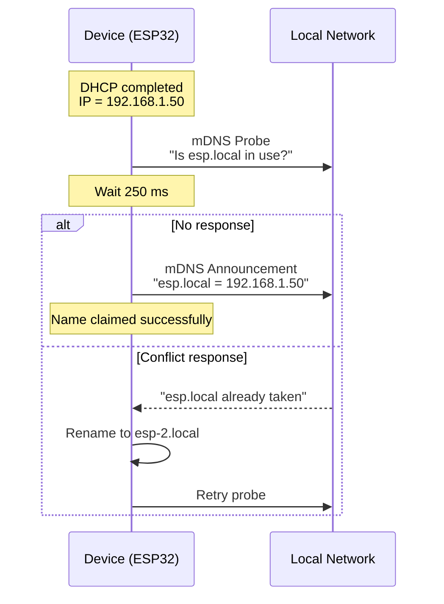

# How `esp.local` Works — mDNS from Zero (After DHCP)

## 1. What Problem Are We Solving?

We want to understand:

> **After DHCP gives an IP address, how does a device use `esp.local` and what actually happens on the wire?**

This document explains:
- What `esp.local` really is
- Who defines it
- How conflicts are handled
- What packets are sent (structure-level, not hand-wavy)

No prior networking knowledge is assumed.

---

## 2. First Principles: What `esp.local` Is (and Is NOT)

### ❌ What `esp.local` is NOT
- Not assigned by DHCP
- Not configured by the router
- Not stored on a server
- Not discovered from the network

### ✅ What `esp.local` IS
- A **self-chosen hostname**
- Used only on the **local network**
- Resolved using **mDNS (Multicast DNS)**

---

## 3. Who Defines `esp.local`?

**The device itself defines it.**

Inside firmware (conceptually):

```c
hostname = "esp";
domain   = ".local";
fqdn     = "esp.local";
```

This is just a **string** chosen by the firmware.

There is **no registration** step.

---

## 4. Why DHCP Must Happen First

Before DHCP:

* Device has **no IP**
* Cannot identify itself
* Cannot receive replies

After DHCP:

* Device has an IP (example: `192.168.1.50`)
* Device knows it is on subnet `192.168.1.0/24`
* Device can now participate in local protocols

### DHCP gives:

| Parameter   | Example       |
| ----------- | ------------- |
| IP address  | 192.168.1.50  |
| Subnet mask | 255.255.255.0 |
| Gateway     | 192.168.1.1   |
| DNS servers | 8.8.8.8       |

**DHCP does NOT mention mDNS at all.**

---

## 5. What mDNS Actually Is

**mDNS = Multicast Domain Name System**

It works by **shouting on the local network**.

These values are **fixed by specification** and hard-coded into the stack:

| Item         | Value           |
| ------------ | --------------- |
| Multicast IP | `224.0.0.251`   |
| UDP Port     | `5353`          |
| Scope        | Local link only |
| IPv6         | `ff02::fb`      |

The device already knows these values **before it boots**.

---

## 6. The Core Rule (Critical)

> **mDNS names are not assigned — they are argued for.**

Rule:

* Silence = name is free
* Objection = rename

There is **no central authority**.

---

## 7. High-Level Flow



---

## 8. Phase 1 — mDNS PROBE (Question Packet)

### Purpose

> "I want to use `esp.local`.
> Is anyone already using it?"

### Simplified Packet Structure

```
Ethernet:
  Destination MAC: 01:00:5E:00:00:FB   (multicast)
  Source MAC: ESP32 MAC

IP:
  Source IP: 0.0.0.0  (or own IP if bound)
  Destination IP: 224.0.0.251

UDP:
  Source Port: 5353
  Destination Port: 5353

DNS (mDNS):
  Flags: Query
  Question Count: 1
  Authority Count: 1

Question:
  Name: esp.local
  Type: ANY
  Class: IN

Authority (Intent):
  Name: esp.local
  Type: A
  IP: 192.168.1.50
```

### Plain English

> "I plan to use `esp.local` for IP `192.168.1.50`.
> Speak now if this is wrong."

---

## 9. What If Someone Replies "YES, I Own It"?

### Conflict Response Packet

```
IP:
  Source IP: 192.168.1.20
  Destination IP: 224.0.0.251

DNS:
  Flags: Response
  Answer Count: 1

Answer:
  Name: esp.local
  Type: A
  IP: 192.168.1.20
```

### Meaning

> "No. `esp.local` already belongs to me."

---

## 10. Mandatory Rename Logic

If a conflict is detected, the device **must rename**.

Typical algorithm:

```
esp.local     → conflict
esp-2.local   → probe
esp-3.local   → if needed
```

Then repeat probing.

---

## 11. Phase 2 — ANNOUNCEMENT (Claim Packet)

If no conflict after **3 probes** (250 ms apart):

```
IP:
  Source IP: 192.168.1.50
  Destination IP: 224.0.0.251

UDP:
  Source Port: 5353
  Destination Port: 5353

DNS:
  Flags: Response + Authoritative
  Answer Count: 1

Answer:
  Name: esp.local
  Type: A
  IP: 192.168.1.50
  TTL: 120 seconds
  Cache-Flush: Set
```

### Meaning

> "`esp.local` is mine.
> Cache this mapping."

---

## 12. Why Everyone Can Resolve `esp.local`

Because:

* Everyone listens on `224.0.0.251:5353`
* Everyone caches announcements
* No router, DNS server, or internet involved

This is why:

```
ping esp.local
```

works instantly on the same Wi-Fi.

---

## 13. Ultra-Compact Mental Model

```
DHCP → gives identity (IP)
mDNS → argue for a name
Silence → name is yours
Reply → rename
```

---

## 14. Final Truth (Non-Negotiable)

* `esp.local` is **self-defined**
* mDNS uses **multicast shouting**
* DHCP does **not** participate
* There is **no central control**
* Conflicts are resolved by **renaming**

---

## 15. Where This Often Breaks (FYI)

* Routers blocking multicast
* IGMP snooping misconfigured
* Power-saving APs
* Enterprise / Guest Wi-Fi

mDNS is **convenience, not reliability**.

---

## End of Document

---

If you want, next we can:
- Map this **line-by-line to ESP-IDF APIs**
- Decode a **real Wireshark capture**
- Explain **IGMP join** (why multicast sometimes fails)

Say the next step **clearly** and we continue.
